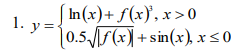

# C_Task8
Модифицировать код лабораторных работ 1-8 с использованием
новых возможностей стандартов C++11,14,17.

#C_Task1_var1
Для заданного x и функции f (x) вычислить значение выражения. Предусмотреть выбор вида функции f (x) (x^2, e^x ,sin(x))

#C_task2_var7
Написать функцию вычисления обратной матрицы. Размер матрицы задается с клавиатуры.

#C_Task3_Var6
Дан текстовый файл f1, содержащий текст на английском языке. Отсортировать слова по возрастанию длины и полученный результат записать в файл f2.

#C_Task4_var10
Описать структуру, содержащую информацию о деятельности музея. Поля структуры должны включать информацию о сотрдниках, залах, экспонатах, экскурсиях и т.п. Создать файл данных, содержащий сведения о нескольких экспонатах. Написать программу, позволяющую добавлять новые экспонаты (с сохранением данных в файл), а также выбирать и выводить необходимую информацию об имеющихся экспонатах на экран. Например, вывести список всех экспонатов второго зала. Формы запросов придумать самостоятельно.

#C_Task5_var1
Написать абстрактный класс «Летательный аппарат». На его основе реализовать классы «Самолет», «Вертолет», «Крылатая ракета» и т.п. Написать программу, демонстрирующую работу с этими классами.

#C_Task6_var7
Написать класс «Множество». Реализовать конструкторы, деструктор, методы добавления и удаления элементов, поиска пересечения двух множеств. Реализовать перегрузку оператора разность (-) для формирования разности множеств. Предложить и реализовать дружественную функцию для данного класса.

#C_Task7_var7
Определить шаблоны соответствующих классов. Написать тестовую программу, демонстрирующую работу шаблонных классов с различными типами данных.

